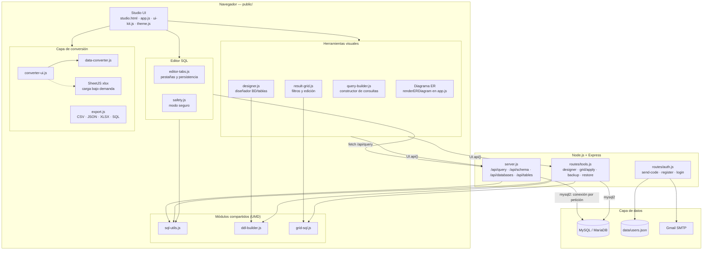
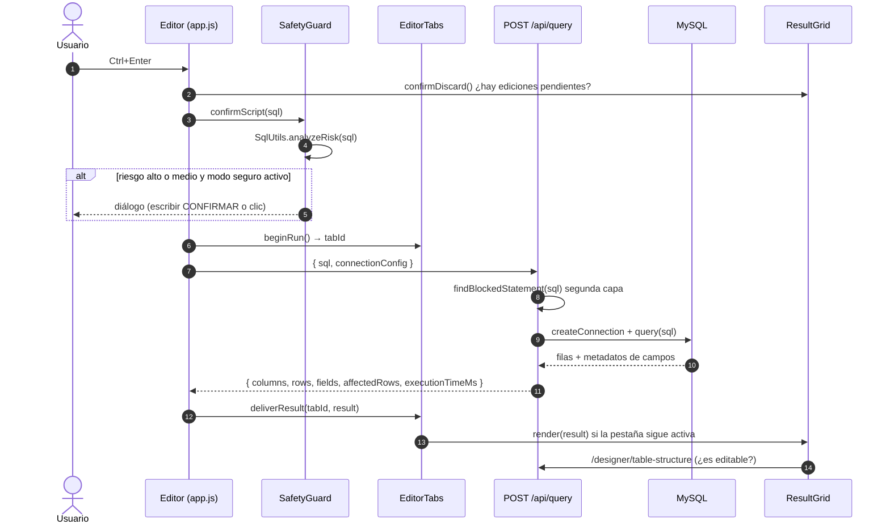
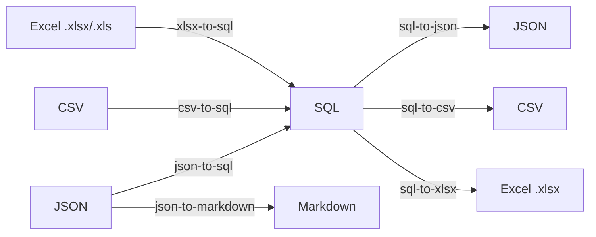
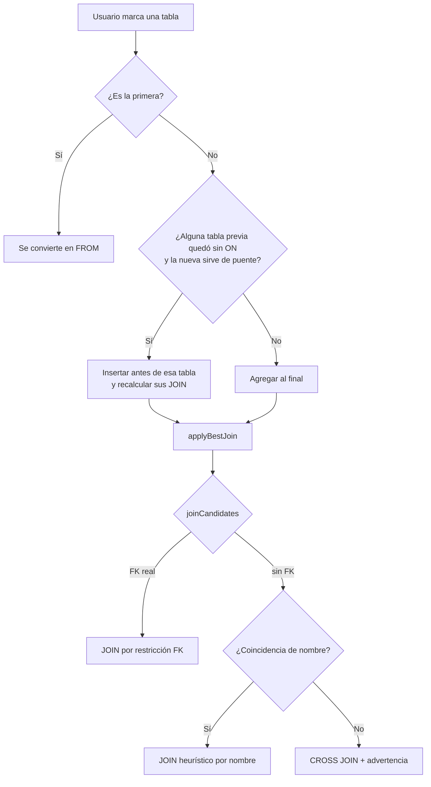
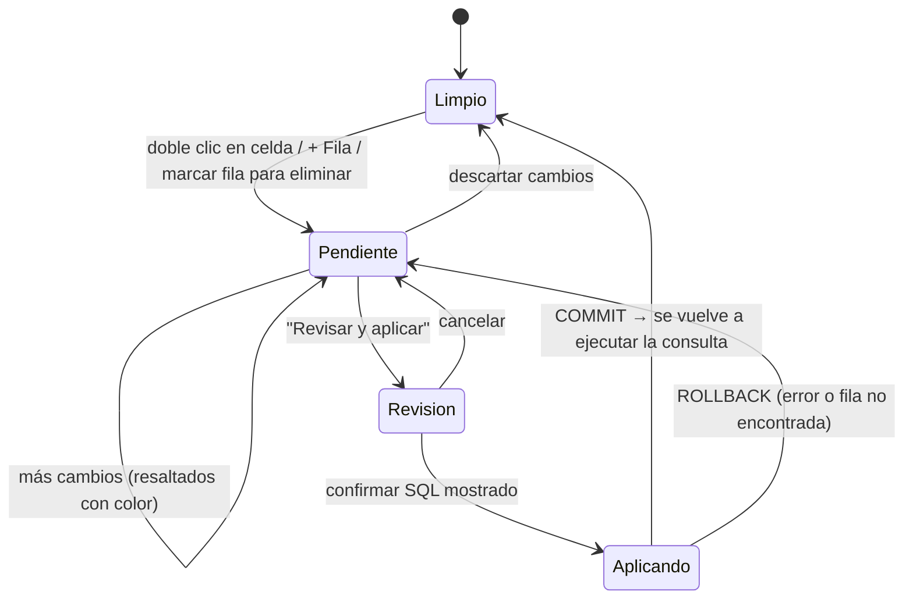
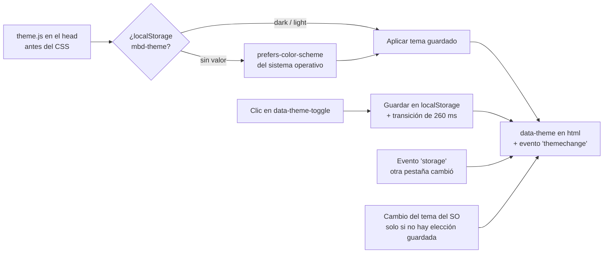

# My Best DataBase — Documentación Técnica

**Sistema gestor de bases de datos MySQL con interfaz web**

| Campo | Valor |
|---|---|
| Versión del sistema | 1.0.0 (`package.json`) |
| Versión del documento | 1.1 — 25 de septiembre de 2026 (correcciones de seguridad S-1 a S-8) |
| Audiencia | Desarrolladores, mantenedores y evaluadores técnicos |
| Repositorio | `My-Best-DataBase/` |
| Documento complementario | `README.md` (visión general, objetivos y guía de uso) |

> **Alcance de este documento.** El `README.md` explica *qué* hace el sistema y *cómo se usa*. Este documento explica *cómo está construido*: arquitectura, contratos entre módulos, algoritmos, decisiones de diseño y riesgos conocidos. Todo lo descrito aquí corresponde al código fuente de la versión 1.0.0; cuando una característica no existe o funciona de forma distinta a lo que su nombre podría sugerir, se indica explícitamente.

---

## Tabla de contenido

1. [Resumen del sistema y arquitectura general](#1-resumen-del-sistema-y-arquitectura-general)
2. [Stack tecnológico y dependencias](#2-stack-tecnológico-y-dependencias)
3. [Especificación de módulos core](#3-especificación-de-módulos-core)
   - 3.1 [Editor SQL y consola](#31-editor-sql-y-consola)
   - 3.2 [Motor de conversión de formatos](#32-motor-de-conversión-de-formatos-data-converter-engine)
   - 3.3 [Constructor visual de consultas](#33-constructor-visual-de-consultas-visual-query-builder)
   - 3.4 [Diagrama ER, diseñador y edición en el grid](#34-diagrama-er-diseñador-de-tablas-y-edición-en-el-grid)
   - 3.5 [Respaldo, restauración y exportación](#35-respaldo-restauración-y-exportación)
4. [Gestión de estado, UI/UX y tema](#4-gestión-de-estado-uiux-y-tema)
5. [Seguridad y rendimiento](#5-seguridad-y-rendimiento)
6. [Referencia de la API REST](#6-referencia-de-la-api-rest)
7. [Guía de instalación, configuración y despliegue](#7-guía-de-instalación-configuración-y-despliegue)
8. [Decisiones de arquitectura (ADR)](#8-decisiones-de-arquitectura-adr)
9. [Deuda técnica y hoja de ruta](#9-deuda-técnica-y-hoja-de-ruta)
10. [Glosario](#10-glosario)

---

## 1. Resumen del sistema y arquitectura general

### 1.1 Descripción general

*My Best DataBase* es un cliente web para servidores MySQL (compatible con MariaDB), inspirado en MySQL Workbench. Reúne en un único espacio de trabajo —el **Studio**— las operaciones más frecuentes sobre una base de datos relacional:

- Escribir y ejecutar SQL (editor con resaltado, autocompletado y pestañas).
- Inspeccionar el esquema (árbol de bases de datos y diagrama Entidad-Relación).
- Diseñar bases de datos y tablas mediante formularios, con vista previa del DDL generado.
- Construir consultas `SELECT` de forma visual, con `JOIN` inferidos a partir de las llaves foráneas.
- Filtrar, ordenar y editar registros directamente sobre la cuadrícula de resultados.
- Respaldar, restaurar, exportar y convertir datos entre formatos.

**Problema que resuelve.** La línea de comandos exige dominar la sintaxis SQL y no ofrece una vista de las relaciones; las herramientas profesionales resultan excesivas en un contexto formativo. El sistema cubre ese hueco con un principio rector: **toda acción visual muestra el SQL que genera**, de modo que la interfaz enseña el lenguaje en lugar de ocultarlo.

### 1.2 Patrón de arquitectura

El sistema es una aplicación **cliente-servidor de tres capas** con comunicación **REST sobre HTTP/JSON**:

| Capa | Ubicación | Responsabilidad |
|---|---|---|
| Presentación | `public/` (navegador) | Interfaz multipágina (`login.html`, `studio.html`) construida con JavaScript sin *frameworks*. Cada funcionalidad es un módulo IIFE que expone un objeto global (`EditorTabs`, `ResultGrid`, `QueryBuilder`, etc.). |
| Lógica / API | `server.js`, `routes/` (Node.js + Express) | Autenticación, ejecución de SQL, lectura de metadatos, generación y ejecución de DDL, edición transaccional, respaldo y restauración. |
| Datos | Servidor MySQL/MariaDB y `data/users.json` | Las bases de datos del usuario viven en MySQL; las cuentas de la aplicación, en un archivo JSON local. |

Tres rasgos definen la arquitectura:

1. **Servidor sin estado de conexión.** El navegador envía la configuración de conexión (`connectionConfig`) en *cada* petición; el servidor abre una conexión `mysql2`, ejecuta y la cierra en el bloque `finally`. No hay *pool* ni sesiones de base de datos en el servidor.
2. **Módulos isomórficos (compartidos).** `sql-utils.js`, `ddl-builder.js`, `grid-sql.js` y `data-converter.js` se ejecutan tanto en el navegador como en Node.js mediante un envoltorio UMD. El SQL que el usuario ve en la vista previa es exactamente el que el servidor valida y ejecuta (ver [ADR-02](#adr-02-módulos-isomórficos-para-generar-sql)).
3. **Procesamiento de formatos en el cliente.** La conversión JSON/CSV/SQL/Excel/Markdown y la exportación de resultados se realizan íntegramente en el navegador; los datos no viajan al servidor para convertirse.

### 1.3 Diagrama de componentes



### 1.4 Flujo de datos de una consulta



### 1.5 Estructura del código fuente

```
My-Best-DataBase/
├── server.js               # Express, middlewares, /api/query, metadatos y rutas HTML
├── lib/
│   └── security.js         # Clave JWT, middleware requireAuth, limitador de intentos
├── routes/
│   ├── auth.js             # Registro con OTP por correo, login JWT
│   └── tools.js            # Diseñador DDL, edición transaccional, respaldo, restauración
├── data/users.json         # Cuentas de la aplicación (contraseñas bcrypt)
└── public/
    ├── login.html · studio.html
    ├── css/                # theme.css (variables), global, login, studio, features, converter, query-builder
    └── js/
        ├── sql-utils.js      [UMD] división de scripts, análisis de riesgo, cláusulas
        ├── ddl-builder.js    [UMD] CREATE DATABASE / CREATE TABLE / ALTER TABLE
        ├── grid-sql.js       [UMD] filtros → WHERE; ediciones → UPDATE/INSERT/DELETE
        ├── data-converter.js [UMD] tokenizador + parser de INSERT, formateadores
        ├── auth.js · ui-kit.js · theme.js
        ├── app.js            # editor, ejecución, árbol lateral, diagrama ER
        ├── editor-tabs.js · safety.js · export.js · designer.js
        ├── backup.js · result-grid.js · converter-ui.js · query-builder.js
```

El orden de carga en `studio.html` es significativo: primero los módulos compartidos (`sql-utils` → `ddl-builder` → `grid-sql`), después `auth`, `ui-kit` y `app`, y por último los módulos de funcionalidad. `theme.js` se carga en el `<head>` antes de las hojas de estilo para evitar el parpadeo del tema incorrecto.

---

## 2. Stack tecnológico y dependencias

### 2.1 Resumen

| Área | Tecnología | Observaciones |
|---|---|---|
| Entorno de ejecución | Node.js ≥ 18 (probado con v22) | Usa `performance.now()` global y `fetch` en el cliente. |
| Servidor HTTP | Express 4.19 | `express.json({ limit: '60mb' })` para restaurar respaldos grandes. |
| Conector de BD | `mysql2` 3.x (API de promesas) | Único conector. No hay soporte para PostgreSQL ni SQLite. |
| Autenticación | `jsonwebtoken` 9, `bcryptjs` 2.4 | JWT de 8 horas; hash con costo 10. |
| Correo | `nodemailer` 6 (servicio Gmail) | Envío del código de verificación de 6 dígitos. |
| Hojas de cálculo | `xlsx` (SheetJS) 0.18 | Servido desde `node_modules/xlsx/dist` en `/vendor/xlsx`. |
| Configuración | `dotenv` 16 | Lee `.env` en la raíz. |
| CORS | `cors` 2.8 | Desactivado por defecto (la interfaz es del mismo origen); solo se habilita para los orígenes listados en `CORS_ORIGIN`. |
| Frontend | HTML5 + CSS3 + JavaScript ES2020 sin *frameworks* | Sin empaquetador ni paso de compilación. |
| Desarrollo | `nodemon` 3 | `npm run dev`. |
| Escritorio (experimental) | `electron` 30, `electron-builder` 24 | Declarados en `devDependencies`; ver §7.5. |

### 2.2 Frontend: por qué JavaScript sin framework

El frontend **no** usa React, Vue ni Tailwind. Cada funcionalidad es un **módulo IIFE** que encapsula su estado privado y expone una API pública mínima en `window`:

```javascript
// Patrón usado por EditorTabs, ResultGrid, QueryBuilder, Designer, Backup, SafetyGuard...
const ResultGrid = (() => {
  const structureCache = {};   // estado privado
  let current = null;

  function render(r) { /* ... */ }
  function invalidateStructure() { /* ... */ }

  return { render, invalidateStructure, confirmDiscard /* ... */ };
})();
```

La comunicación entre módulos se hace por llamadas directas a esas APIs, protegidas con `typeof X !== 'undefined'` para que cada módulo degrade con elegancia si otro no se cargó. **Estilos:** CSS plano organizado por funcionalidad, con todos los colores definidos como **variables CSS** en `theme.css` (ver §4.1).

### 2.3 Librerías de edición y formatos

| Necesidad | Solución implementada | Alternativas descartadas |
|---|---|---|
| Editor de código | **Implementación propia**: `<textarea>` transparente superpuesto a un `<pre><code>` coloreado (técnica de "capas sincronizadas"). | Monaco / CodeMirror: mayor peso y dependencia de CDN o empaquetador. |
| Leer Excel (`.xlsx`, `.xls`) | **SheetJS** (`XLSX.read`), cargado bajo demanda solo al usar un flujo con Excel. | `exceljs`: no lee `.xls` binario. |
| Escribir Excel desde el conversor | **SheetJS** (`XLSX.write`, con compresión). | — |
| Escribir Excel desde la exportación de resultados | **Escritor OOXML propio** en `export.js`: genera el XML de la hoja y lo empaqueta en un ZIP (método *store*, CRC-32 calculado a mano). | Evita cargar SheetJS para una exportación rápida. |
| Diagrama ER | **HTML + CSS Grid**: una tarjeta por tabla y un panel con la lista de relaciones. | D3.js / GoJS / Canvas: no se usan; las relaciones **no** se dibujan como líneas (ver §9). |

### 2.4 Backend y conectores

Solo existe el conector **`mysql2/promise`**. Se usan dos configuraciones:

```javascript
// server.js — ejecución de consultas del editor
mysql.createConnection({
  host, port: port || 3306, user, password, database,
  multipleStatements: true,   // scripts con varias sentencias
  dateStrings: true,          // fechas tal como están guardadas (sin desfase de zona horaria)
  typeCast(field, next) {     // columnas JSON como texto
    if (field.type === 'JSON') return field.string('utf8');
    return next();
  }
});

// routes/tools.js — openConnection(): además preserva enteros grandes
{ supportBigNumbers: true, bigNumberStrings: true, /* GEOMETRY → Buffer */ }
```

---

## 3. Especificación de módulos core

### 3.1 Editor SQL y consola

**Archivos:** `public/js/app.js` (`initEditor`, `highlightSqlHtml`, `runScriptQuery`, `logConsole`), `public/js/editor-tabs.js`, `public/css/studio.css`.

#### 3.1.1 Arquitectura de capas sincronizadas

El editor se compone de tres elementos superpuestos dentro de `.code-editor-wrapper`:

```
┌────┬───────────────────────────────────────────────┐
│ 1  │ <pre id="highlighting"><code>  ← capa de color │  z-index 1, pointer-events: none
│ 2  │ <textarea id="sqlEditor">      ← capa editable │  texto transparente, cursor visible
│ 3  │                                                │
└────┴───────────────────────────────────────────────┘
  └─ <pre id="lineNumbers">  ← números de línea
```

El usuario escribe en el `<textarea>` (cuyo texto es `color: transparent` y solo muestra el cursor, `caret-color: var(--editor-caret)`), mientras ve el `<pre>` coloreado que queda debajo. Esta técnica funciona **solo si ambas capas colocan cada carácter en el mismo píxel**.

#### 3.1.2 Prevención de desfases visuales

Cualquier diferencia de métrica tipográfica desplaza el color respecto del cursor. Para evitarlo, `studio.css` define una métrica única en variables y la aplica de forma idéntica a las tres capas:

```css
:root {
  --editor-font: Consolas, 'Cascadia Mono', 'Courier New', monospace;
  --editor-font-size: 13px;
  --editor-line-height: 20px;   /* entero: evita acumulación de subpíxeles */
  --editor-pad-y: 10px;
  --editor-pad-x: 14px;
}

.highlighting-pane, .highlighting-pane code, .code-editor {
  font-family: var(--editor-font);
  font-size: var(--editor-font-size);
  line-height: var(--editor-line-height);
  font-kerning: none;
  font-variant-ligatures: none;           /* sin ligaduras: 1 carácter = 1 celda */
  font-feature-settings: "liga" 0, "calt" 0;
  letter-spacing: 0;
  tab-size: 4;
  white-space: pre;                        /* sin ajuste de línea */
}

.highlighting-pane, .code-editor {
  position: absolute; inset: 0;
  padding: var(--editor-pad-y) var(--editor-pad-x);
  box-sizing: border-box;
  overflow: scroll;   /* barras siempre presentes en ambas capas → mismo ancho útil */
}
```

| Riesgo de desfase | Contramedida |
|---|---|
| Interlineado fraccionario que se acumula | `line-height` entero (20 px). |
| Ligaduras (`!=`, `->`) que cambian el ancho | Ligaduras y *kerning* desactivados. |
| Ajuste automático de línea distinto en cada capa | `white-space: pre` en ambas. |
| Barra de desplazamiento presente solo en una capa | `overflow: scroll` en ambas. |
| Último salto de línea ignorado por `<pre>` | Se añade un espacio al final del HTML cuando el texto termina en `\n`. |
| Desplazamiento independiente | `syncScroll()` copia `scrollTop`/`scrollLeft` del `<textarea>` al `<pre>` y a los números de línea en cada evento `scroll`, `input` y en un `ResizeObserver`. |

```javascript
const syncScroll = () => {
  lineNumbers.scrollTop = editor.scrollTop;
  highlightingPane.scrollTop = editor.scrollTop;
  highlightingPane.scrollLeft = editor.scrollLeft;
};
editor.addEventListener('scroll', syncScroll, { passive: true });
new ResizeObserver(syncScroll).observe(editor);
```

#### 3.1.3 Resaltado de sintaxis en una sola pasada

`highlightSqlHtml(text)` recorre el texto **una sola vez** con una expresión regular global cuyos grupos clasifican cada token:

```javascript
// 1 comentario  2 cadena  3 `identificador`  4 número  5 palabra
const SQL_TOKEN_RE = /(--[^\n]*|#[^\n]*|\/\*[\s\S]*?(?:\*\/|$))|('(?:''|\\[\s\S]|[^'\\])*(?:'|$)|"(?:""|\\[\s\S]|[^"\\])*(?:"|$))|(`(?:``|[^`])*(?:`|$))|(\b\d+(?:\.\d+)?\b)|([A-Za-z_][\w$]*)/g;
```

- Cada fragmento se escapa (`&`, `<`, `>`) **antes** de envolverse en `<span>`, por lo que el HTML resultante contiene exactamente los mismos caracteres visibles que el `<textarea>`.
- Una palabra se colorea como función (`sql-function`) solo si está en `SQL_FUNCTIONS` **y** va seguida de `(`; como palabra clave, si está en `SQL_KEYWORDS`.
- Cadenas y comentarios sin cerrar se colorean hasta el final, como en un IDE.

> **Nota de diseño.** Una versión anterior encadenaba varios `.replace()` sobre el HTML ya generado; la regla de cadenas `"..."` volvía a coincidir con `class="sql-comment"` y producía etiquetas rotas, además de recorrer el texto ~70 veces por tecla. El tokenizador de una pasada resolvió ambos problemas.

**Optimizaciones:** se omite el repintado si el texto no cambió (por ejemplo, al mover solo el cursor); los números de línea se reconstruyen solo cuando cambia la cantidad de líneas; y los scripts de más de 50 000 caracteres se repintan como máximo una vez por cuadro mediante `requestAnimationFrame`.

#### 3.1.4 Atajos y comandos de ejecución

| Atajo | Acción | Implementación |
|---|---|---|
| `Ctrl + Enter` / `⌘ + Enter` | Ejecuta el script completo | `runScriptQuery(false)` |
| `F5` | Ejecuta el script completo | `runScriptQuery(false)` |
| `Ctrl + Shift + Enter` | Ejecuta solo el texto seleccionado | `runScriptQuery(true)`; si no hay selección, registra un error en consola |
| `Tab` | Inserta dos espacios | `document.execCommand('insertText')` para conservar el historial de deshacer (`Ctrl+Z`) |
| `↑` `↓` `Enter` `Tab` `Esc` | Navegan / aplican / cierran el autocompletado | Solo mientras el menú está visible |

**Autocompletado:** al escribir dos o más caracteres alfanuméricos se sugieren hasta siete coincidencias entre `SQL_KEYWORDS` y `SQL_FUNCTIONS`. *Limitación:* no sugiere todavía nombres de tablas ni columnas del esquema activo.

**Pipeline de `runScriptQuery()`:**

1. Obtiene el SQL (completo o selección) y rechaza entradas vacías.
2. `ResultGrid.confirmDiscard()` — si hay ediciones sin aplicar en el grid, pide confirmación.
3. `SafetyGuard.confirmScript(sql)` — análisis de riesgo (§5.1).
4. `EditorTabs.beginRun()` — reserva el resultado para la pestaña que lanzó la consulta.
5. `POST /api/query` con `{ sql, connectionConfig }`.
6. Identifica la **consulta base**: si la última sentencia del script es un `SELECT` y devolvió columnas, se guarda como `baseSql` para los filtros y la edición del grid.
7. Entrega el resultado a la pestaña; si sigue visible, lo pinta con `ResultGrid.render()`.
8. Si el SQL contiene `CREATE/DROP DATABASE|TABLE|VIEW`, `ALTER TABLE` o `RENAME TABLE`, invalida las cachés de esquema y recarga el árbol lateral.

#### 3.1.5 Ejecución de scripts de varias sentencias

El servidor ejecuta el script completo en una sola llamada (`multipleStatements: true`). Cuando `mysql2` devuelve un arreglo de resultados, el servidor muestra **el último que tenga filas** (como Workbench) y **suma** las `affectedRows` de las sentencias DML.

La división en sentencias para el análisis de riesgo, la restauración y la identificación de la consulta base la realiza `SqlUtils.splitStatements()`, que respeta:

- Cadenas `'...'` y `"..."` (con escapes `\'` y comillas duplicadas), e identificadores `` `...` ``.
- Comentarios `-- `, `#` y `/* */`, incluidos los condicionales `/*! ... */` de `mysqldump` (que sí se consideran código).
- La directiva **`DELIMITER`**, necesaria para disparadores y procedimientos almacenados.

```javascript
SqlUtils.splitStatements(`
DELIMITER ;;
CREATE TRIGGER t BEFORE INSERT ON x FOR EACH ROW BEGIN SET NEW.a = 1; END;;
DELIMITER ;
SELECT 'a;b';`);
// → [{ sql: "CREATE TRIGGER t ... END", line: 3 }, { sql: "SELECT 'a;b'", line: 5 }]
```

#### 3.1.6 Pestañas, historial y mensajes

- **Pestañas (`editor-tabs.js`).** Cada pestaña guarda su título, su SQL, la posición de la selección y su último resultado. El texto (no los resultados) se persiste en `localStorage` bajo la clave `mbdb.editorTabs`, con un retardo (*debounce*) de 300 ms, y se restaura al volver a iniciar sesión. Un resultado que llega cuando su pestaña ya no está activa se almacena sin repintar la vista.
- **Consola de registros (`logConsole`).** Bitácora con marca de tiempo de cada ejecución: el SQL enviado, las filas devueltas, las filas afectadas, el tiempo de respuesta y los mensajes de error de MySQL. Los tipos `info`, `success` y `error` se diferencian por color.
- **Historial de consultas.** *No existe un historial dedicado* de consultas ejecutadas. El registro de la sesión vive en la consola (se pierde al recargar) y el trabajo del usuario persiste en las pestañas. Un historial consultable es una mejora propuesta en §9.

---

### 3.2 Motor de conversión de formatos (Data Converter Engine)

**Archivos:** `public/js/data-converter.js` (lógica pura, sin DOM, UMD) y `public/js/converter-ui.js` (interfaz del modal).

#### 3.2.1 Matriz de conversiones soportadas

El motor maneja cinco formatos, pero no todas las combinaciones. Las rutas implementadas son:

| Origen ↓ / Destino → | SQL (`INSERT`) | JSON | CSV | Excel (`.xlsx`) | Markdown |
|---|:---:|:---:|:---:|:---:|:---:|
| **JSON** | ✅ `json-to-sql` | — | ❌ | ❌ | ✅ `json-to-markdown` |
| **CSV** | ✅ `csv-to-sql` | ❌ | — | ❌ | ❌ |
| **SQL** (`INSERT`) | — | ✅ `sql-to-json` | ✅ `sql-to-csv` | ✅ `sql-to-xlsx` | ❌ |
| **Excel** (`.xlsx`, `.xls`) | ✅ `xlsx-to-sql` | ❌ | ❌ | — | — |

Markdown solo es formato de **salida**. El SQL funciona como **formato pivote**: cualquier formato de entrada puede llegar a SQL, y desde SQL se puede llegar a JSON, CSV o Excel, por lo que, por ejemplo, CSV → Excel se logra en dos pasos (CSV → SQL → Excel).



#### 3.2.2 Modelo intermedio

Todas las rutas convergen en una representación tabular común:

```typescript
interface ParsedTable {
  name: string;            // nombre de la tabla destino u origen
  schema: string | null;   // esquema, si venía como esquema.tabla
  columns: string[];       // orden de columnas (unión de todas las filas)
  rows: Array<Record<string, string | number | boolean | null>>;
}

interface ParseResult {
  tables: ParsedTable[];   // una por cada tabla distinta encontrada
  statements: number;      // sentencias INSERT procesadas
  skipped: number;         // sentencias que no son INSERT (ignoradas)
  warnings: string[];
}
```

#### 3.2.3 Parser de sentencias `INSERT INTO`

Es un **analizador en dos fases** —léxico y sintáctico— escrito a mano. No usa expresiones regulares para interpretar valores, lo que permite reportar errores con **línea y columna exactas**.

**Fase 1 — Tokenizador (`tokenize`).** Recorre el texto carácter a carácter y produce tokens tipados:

| Tipo | Ejemplos | Tratamiento |
|---|---|---|
| `word` | `INSERT`, `clientes`, `NOW`, `@var` | Palabras clave e identificadores sin comillas (admite letras acentuadas). |
| `ident` | `` `mi tabla` ``, `[col]` | Identificadores entre *backticks* (con ` `` ` escapado) o corchetes. |
| `string` | `'O''Brien'`, `"a\nb"` | El valor se **desescapa**: `''` y `""` duplicadas, y secuencias MySQL `\0 \b \n \r \t \Z \\ \' \"`. |
| `number` | `12`, `-3.5`, `.5`, `2.5E-3` | Se conserva el texto original en `raw`. `123abc` se trata como palabra, como en MySQL. |
| `raw` | `X'4F'`, `0x4F`, `b'1010'` | Literales hexadecimales y binarios, sin interpretar. |
| `punct` | `( ) , ; . =` | Símbolos sueltos. |

Los comentarios `--`, `#` y `/* */` se descartan en esta fase. Una cadena, un identificador o un comentario sin cerrar lanzan `ConversionError` con la ubicación del inicio.

**Fase 2 — Parser recursivo descendente (`parseInserts`).** Gramática aceptada:

```
script        := { sentencia_insert | otra_sentencia | ";" }
sentencia_insert
              := ("INSERT" | "REPLACE") [modificadores] ["INTO"] nombre_tabla
                 [ "(" columna { "," columna } ")" ]
                 ( "VALUES" | "VALUE" ) fila { "," fila }
               | ... "SET" columna "=" valor { "," columna "=" valor }
                 [ "ON DUPLICATE KEY UPDATE" ... | "AS" alias ... ] [";"]
modificadores := LOW_PRIORITY | DELAYED | HIGH_PRIORITY | IGNORE
nombre_tabla  := identificador [ "." identificador ]
fila          := ["ROW"] "(" [ valor { "," valor } ] ")"
```

Cualquier otra sentencia (`CREATE`, `SET`, `LOCK TABLES`…) se **salta** hasta el siguiente `;` de nivel superior, de modo que el parser acepta directamente un respaldo generado por `mysqldump` o por el propio sistema.

**Mapeo de valores (`readValue`):**

| Literal SQL | Valor JavaScript |
|---|---|
| `'texto'` / `"texto"` | `string` desescapado |
| `42`, `-3.14`, `1e10` | `number` |
| Entero mayor que `Number.MAX_SAFE_INTEGER` o decimal con 16 o más dígitos | `string` (evita la pérdida de precisión de `BIGINT`/`DECIMAL`) |
| `NULL`, `DEFAULT` | `null` |
| `TRUE` / `FALSE` | `boolean` |
| Expresión (`NOW()`, `1+1`, `CONCAT(...)`) | `string` con el **texto original** de la expresión |

**Manejo de múltiples filas y tablas:**

- Varias tuplas en un mismo `VALUES (...), (...)` producen varias filas.
- Varias sentencias hacia la **misma** tabla se fusionan; las columnas nuevas se agregan en orden y las filas que no las tenían reciben `null`.
- Varias tablas distintas producen varias `ParsedTable` (en JSON: `{ "tabla": [...] }`; en Excel: una hoja por tabla).
- Sin lista de columnas, se nombran `columna_1`, `columna_2`, … y se emite una advertencia.

**Validaciones y mensajes de error:**

```text
Línea 3, columna 12: La fila #2 de "clientes" tiene 2 valor(es) pero se declararon 3 columna(s).
Línea 5, columna 20: Falta una coma entre dos valores. Se encontró "'Ana'".
Línea 1, columna 29: INSERT ... SELECT no se puede convertir: los datos vienen de otra consulta.
```

La interfaz usa `err.loc` para seleccionar la línea con error en el área de entrada.

#### 3.2.4 Algoritmos de las demás conversiones

**JSON → SQL / Markdown (`parseJsonInput`).** Acepta un objeto o un arreglo de objetos. Las columnas son la **unión** de las llaves de todos los objetos (no solo del primero), en orden de aparición. Si `JSON.parse` falla, la posición que reporta el motor (`at position N`) se traduce a línea y columna. En Markdown, las barras `|` se escapan como `\|` y los saltos de línea se convierten en `<br>`.

**CSV → SQL (`parseCsv`).** Implementa RFC 4180: campos entre comillas con comas, comillas duplicadas (`""`) y saltos de línea internos. Elimina el BOM y **detecta el separador** (`,`, `;` o tabulador) contando sus apariciones en la primera línea. La inferencia de tipos es conservadora:

| Celda | Resultado |
|---|---|
| Vacía (sin comillas) o `NULL` | `NULL` |
| `-?(0\|[1-9]\d{0,14})(\.\d+)?` sin comillas | Número |
| `007`, `01234` (ceros a la izquierda) | Texto: se preservan teléfonos y códigos postales |
| Cualquier valor entre comillas | Texto literal |

Los encabezados se normalizan con `uniqueHeaders()` (vacíos → `columna_N`; repetidos → `nombre_2`). Las filas con un número distinto de columnas generan una advertencia con sus números de línea.

**Generación de SQL (`buildInserts`).** Produce `INSERT` multifila en **bloques de 100 filas**, con identificadores entre *backticks* (`quoteIdent`) y literales mediante `sqlLiteral()`:

```javascript
DataConverter.buildInserts('clientes', ['id', 'nombre'], [[1, "O'Brien"], [2, null]]);
// INSERT INTO `clientes` (`id`, `nombre`) VALUES
//   (1, 'O''Brien'),
//   (2, NULL);
```

`safeTableName()` deriva un nombre de tabla válido a partir de texto libre (por ejemplo, el nombre del archivo): elimina la extensión y los acentos, sustituye los caracteres no válidos por `_`, antepone `t_` si empieza con dígito y recorta a 64 caracteres.

#### 3.2.5 Entrada y salida binaria de Excel

**Carga perezosa de SheetJS.** La librería (~900 KB) solo se descarga la primera vez que se usa un flujo con Excel. Se intenta primero la copia local y, si falla, el CDN oficial; la promesa se memoriza y se reinicia si ambas fuentes fallan, para permitir un reintento:

```javascript
const SHEETJS_SOURCES = [
  'vendor/xlsx/xlsx.full.min.js',                                // node_modules (sin internet)
  'https://cdn.sheetjs.com/xlsx-0.20.3/package/dist/xlsx.full.min.js'
];
```

**Importación (Excel → SQL):**

1. El archivo se lee como `ArrayBuffer` (límite de 30 MB).
2. `detectSpreadsheet()` **valida la firma binaria** antes de pasarlo a SheetJS: `50 4B 03 04` (ZIP → `.xlsx`/`.xlsm`), `D0 CF 11 E0` (OLE → `.xls` o `.xlsx` cifrado), o XML/HTML con extensión `.xls`. Así se rechazan archivos renombrados.
3. Se lee **solo la primera hoja**; si hay más, se advierte.
4. Las fechas se convierten a `YYYY-MM-DD[ HH:mm:ss]` con `excelSerialToSql()`, **independiente de la zona horaria**: toma como origen el 30/12/1899, corrige el día fantasma 29/02/1900 que Excel considera válido y soporta la base 1904 de los libros de Mac antiguos. Un serial sin parte entera se interpreta como hora pura.
5. Los libros protegidos con contraseña producen un error explícito.

**Exportación (SQL → Excel):** `buildWorkbook()` crea **una hoja por tabla** (nombres saneados a 31 caracteres y únicos), convierte las cadenas con forma de fecha en celdas de fecha reales de Excel, calcula el ancho de las columnas (entre 8 y 60 caracteres) y activa el autofiltro. El `Blob` resultante se descarga con `UI.download()` y se conserva en `state.xlsxBlob` para descargas repetidas.

**Archivos de texto soltados en el modal.** Un `.sql`, `.json` o `.csv` arrastrado al conversor (menor de 20 MB) se lee como texto y selecciona automáticamente el flujo correspondiente.

---

### 3.3 Constructor visual de consultas (Visual Query Builder)

**Archivo:** `public/js/query-builder.js`. La generación de SQL (`buildSql`) es una **función pura**; el estado y el DOM están separados.

> **Correspondencia de nombres.** La especificación original mencionaba una función `resolverJoinsAutomaticos()`. En el código, esa responsabilidad la cumplen tres piezas: **`joinCandidates()`** (inferencia), **`applyBestJoin()`** (asignación) y la **inserción de tablas puente** dentro de `toggleTable()`. Se documentan a continuación con sus nombres reales.

#### 3.3.1 Fuente de metadatos

El constructor consume el mismo diccionario de datos que el diagrama ER (`POST /api/schema`), indexado por nombre de tabla y guardado en una caché por conexión y base de datos:

```javascript
// Clave de caché: "host:port:usuario|base_de_datos"
schema = {
  tables:       [{ name, columns: [{ name, type, isPrimary, isForeign, isNullable, extra }] }],
  relations:    [{ fromTable, fromColumn, toTable, toColumn, constraint }],
  tablesByName: { [tabla]: table }
};
```

#### 3.3.2 Inferencia automática de JOIN

`joinCandidates(table, previous, schema)` busca cómo unir `table` con alguna de las tablas ya seleccionadas (`previous`), en dos niveles de prioridad:

**Nivel 1 — Llaves foráneas reales.** Recorre `schema.relations` en **ambos sentidos** (la nueva tabla puede ser hija o padre). Las relaciones se **agrupan por nombre de restricción**, de modo que una FK compuesta de varias columnas produce una sola condición `ON a AND b`. Los candidatos se ordenan dando preferencia a la tabla seleccionada **más recientemente**, lo que produce encadenamientos naturales (`clientes → pedidos → detalle`).

**Nivel 2 — Heurística por convención de nombres** (solo si no hay ninguna FK). Para cada tabla padre, genera las formas singulares de su nombre (`usuarios → usuario`; `pedidos → pedido`; `clientes → client, cliente`) y busca en la tabla hija una columna llamada `{singular}_id`, `id_{singular}` o `{singular}id`, que se une con la PK del padre (o con su columna `id`).

```javascript
joinCandidates('pedidos', ['clientes'], schema);
// → [{ source: 'fk', label: 'pedidos.cliente_id = clientes.id',
//      on: [{ left: { t: 'pedidos', c: 'cliente_id' }, right: { t: 'clientes', c: 'id' } }] }]
```

`applyBestJoin(entry, index)` toma el primer candidato, copia sus condiciones en `entry.on` y guarda el resto en `entry.candidates` para que el usuario pueda elegir otro desde la interfaz. El tipo de JOIN (`INNER`, `LEFT`, `RIGHT`) y las columnas de la condición son editables.

**Tablas puente.** Si el usuario marca `clientes` y luego `productos` (sin relación directa), `productos` queda sin condición. Cuando después marca `pedidos`, `toggleTable()` detecta que puede servir de **puente** y la inserta *antes* de `productos`, recalculando los JOIN:

```sql
-- Orden de clics: clientes, productos, pedidos  →  SQL generado:
FROM clientes
INNER JOIN pedidos   ON pedidos.cliente_id = clientes.id
INNER JOIN productos ON pedidos.producto_id = productos.id
```

**Recuperación ante cambios.** Al quitar una tabla, los JOIN que dependían de ella se vuelven a inferir; con `makeBase(name)`, la tabla elegida pasa a ser el `FROM` y se recalculan todas las uniones. Si una tabla no tiene condición posible, se genera un `CROSS JOIN` acompañado de una advertencia visible (producto cartesiano).



#### 3.3.3 Estructura de estado

```javascript
const state = {
  db: 'tienda',                 // base de datos inspeccionada
  schema: { /* §3.3.1 */ },
  loading: false, error: '', search: '',
  tables: [                     // el orden define FROM y JOINs
    { name: 'clientes', joinType: 'INNER', on: [], source: null, candidates: [] },
    { name: 'pedidos',  joinType: 'LEFT',
      on: [{ left: { t: 'pedidos', c: 'cliente_id' }, right: { t: 'clientes', c: 'id' } }],
      source: 'fk', candidates: [/* alternativas */], candidateIndex: 0 }
  ],
  cols: {                       // columnas elegidas por tabla
    clientes: { all: false, set: new Set(['id', 'nombre']), order: ['id', 'nombre', 'email'] },
    pedidos:  { all: true,  set: new Set(), order: [/* ... */] }
  },
  open: { clientes: true },     // acordeones abiertos
  filters: [{ id: 1, table: 'pedidos', column: 'total', op: '>=', value: '500', conj: 'AND' }],
  orders:  [{ id: 2, table: 'pedidos', column: 'fecha', dir: 'DESC' }],
  distinct: false,
  limit: '100',                 // valor por defecto: protege al grid de resultados enormes
  lastSql: ''
};
```

#### 3.3.4 Generación del SQL (`buildSql`)

| Cláusula | Regla |
|---|---|
| `SELECT` | Columnas en el orden de la tabla. Si el mismo nombre aparece en varias tablas, se agrega un alias `tabla_columna` automáticamente. Sin columnas marcadas, se usa `*`. |
| Identificadores | `qi()` deja sin comillas los nombres simples y encierra entre *backticks* los que contienen caracteres especiales o son palabras reservadas. |
| `FROM` | Se antepone el esquema solo si la base de datos del constructor difiere de la de la conexión activa. |
| `WHERE` | Operadores `= ≠ > < ≥ ≤ LIKE NOT LIKE IN NOT IN IS NULL IS NOT NULL`, unidos con `AND`/`OR`. Advierte si se mezclan (AND tiene precedencia). Los filtros incompletos se omiten y se marcan en la interfaz. |
| Literales | `literal(raw, colType)`: números sin comillas solo si la columna es numérica; en otro caso, cadena escapada. Respeta las comillas que el usuario escriba; `IN` divide la lista respetando comas entre comillas. |
| `ORDER BY` / `LIMIT` | `ASC`/`DESC` por columna; `LIMIT` solo si es un entero positivo. |

La vista previa se actualiza en tiempo real con el mismo resaltador del editor. **Enviar a Editor SQL** agrega la consulta al final de la pestaña activa (sin borrar su contenido) y la deja seleccionada, lista para `Ctrl+Shift+Enter`.

---

### 3.4 Diagrama ER, diseñador de tablas y edición en el grid

#### 3.4.1 Extracción de metadatos del esquema

Todas las vistas estructurales leen de `information_schema`; nunca se analiza el texto de un `CREATE TABLE`.

| Endpoint | Fuente | Datos |
|---|---|---|
| `POST /api/schema` | `COLUMNS` | Tabla, columna, `COLUMN_TYPE`, nulabilidad, `COLUMN_KEY = 'PRI'`, `EXTRA`. |
| | `KEY_COLUMN_USAGE` (`REFERENCED_TABLE_NAME IS NOT NULL`) | Relaciones FK: origen → destino y nombre de la restricción. Marca `isForeign` en la columna. |
| `POST /api/designer/table-structure` | `TABLES` | Motor, comentario; rechaza vistas. |
| | `COLUMNS` | Además: `COLUMN_DEFAULT`, comentario, `GENERATION_EXPRESSION`. |
| | `STATISTICS` | PK en orden, índices `UNIQUE` de una columna, conteo de índices compuestos. |
| | `KEY_COLUMN_USAGE` ⋈ `REFERENTIAL_CONSTRAINTS` | FKs con sus reglas `ON UPDATE` / `ON DELETE`. |

`loadTableStructure()` consulta `SELECT VERSION()` para distinguir MySQL de MariaDB, ya que ambos reportan el `DEFAULT` de forma distinta (MariaDB lo devuelve como expresión SQL); `normalizeDefault()` unifica ambos formatos.

**Renderizado del diagrama ER** (`renderERDiagram` en `app.js`): una tarjeta por tabla dentro de un contenedor CSS Grid, con insignias **PK**/**FK** por columna y su tipo, un botón ✏️ que abre el diseñador en modo edición, y un panel inferior con las relaciones en forma `tabla.columna ➔ tabla.columna`. Las relaciones se listan, **no se trazan como líneas**.

#### 3.4.2 Diseñador visual (DDL)

`designer.js` mantiene el modelo de la tabla y `ddl-builder.js` lo traduce a SQL:

```javascript
// Modelo de columna
{ id, origName, name, type, length, unsigned, pk, nn, uq, ai, def, onUpdateNow, comment, generated }
// Modelo de llave foránea
{ id, origName, name, columnId, refTable, refColumn, onDelete, onUpdate }  // acciones: RESTRICT | CASCADE | SET NULL | NO ACTION
```

- **`buildCreateTable(def)`** valida los nombres (máx. 64 caracteres; solo letras, números, `_` y `$`; no solo dígitos), los tipos del catálogo `TYPES` y sus longitudes, y la coherencia de las FK. Advierte, por ejemplo, que MyISAM ignora las llaves foráneas.
- **`buildAlterTable(original, edited)`** compara la estructura original con la editada y genera **solo** las cláusulas necesarias: `ADD`/`DROP`/`CHANGE COLUMN` (incluidos movimientos con `AFTER`/`FIRST`), cambio de PK, eliminación y alta de FK (en ese orden) y cambio de nombre. Las columnas se rastrean por `origName`, lo que distingue un renombrado de un borrado seguido de una creación.
- Antes de aplicar cambios destructivos (columnas o FK eliminadas, cambio de nombre), la interfaz pide confirmación.
- Si un paso del `ALTER` falla, el servidor informa qué paso falló y advierte que los anteriores **sí se aplicaron**: el DDL de MySQL provoca un *commit* implícito y no puede revertirse con una transacción.

#### 3.4.3 Edición directa sobre el grid

**Condiciones para que un resultado sea editable** (`ResultGrid.checkEditable`), evaluadas con los metadatos de campo que devuelve `/api/query` (`orgTable`, `orgName`, `db`):

1. Proviene de un `SELECT` (existe `baseSql`).
2. No hay columnas con nombre repetido.
3. Todas las columnas no calculadas provienen de **una sola tabla** (sin `JOIN`).
4. No usa `GROUP BY`, `HAVING`, `UNION` ni `DISTINCT`.
5. La tabla no pertenece a un esquema del sistema y no es una vista.
6. La tabla tiene **llave primaria** y **todas** sus columnas están en el resultado.

Si alguna condición falla, el grid queda en modo de solo lectura y muestra el motivo (por ejemplo: *"incluye la llave primaria (id) en el SELECT para poder editar"*). Las columnas calculadas (`GENERATED`) y las binarias se marcan con 🔒.

**Ciclo de edición:**



El estado pendiente vive en el propio objeto de resultado:

```javascript
result.pending = {
  edits:   { 3: { nombre: 'Ana María' } },   // índice de fila → { columna: valorNuevo }
  deleted: [7],                              // índices de fila marcados para eliminar
  inserts: [{ nombre: 'Luis', activo: 1 }]   // filas nuevas
};
```

**Generación de SQL (`GridSql.buildChanges`).** El servidor —no el navegador— carga la **estructura real** de la tabla y genera las sentencias con el módulo compartido, en este orden:

1. `DELETE ... WHERE pk = valor_original LIMIT 1` (primero, para permitir reinsertar una fila con la misma llave).
2. `UPDATE ... SET col = valor ... WHERE pk = valor_original LIMIT 1`.
3. `INSERT INTO ... (cols) VALUES (...)`; valida que las columnas `NOT NULL` sin valor por defecto ni `AUTO_INCREMENT` tengan valor.

Los valores se validan contra el tipo de columna (un texto en una columna numérica se rechaza) y la nulabilidad. Ejemplo:

```sql
UPDATE `tienda`.`clientes`
SET `nombre` = 'Ana María'
WHERE `id` = 3
LIMIT 1
```

**Ejecución transaccional (`POST /api/grid/apply`):**

```javascript
await connection.beginTransaction();
for (const stmt of built.statements) {
  const [result] = await connection.query(stmt.sql);
  if (stmt.expectOne && result.affectedRows !== 1) {   // concurrencia optimista
    await connection.rollback();
    return res.status(409).json({ error: 'La sentencia no encontró la fila...' });
  }
}
await connection.commit();
```

Si cualquier sentencia falla, **o** un `UPDATE`/`DELETE` no afecta exactamente una fila (porque otra sesión modificó o eliminó el registro), se ejecuta `ROLLBACK` de todo el lote y se responde `409 Conflict`. Esto funciona como un **control de concurrencia optimista** ligero.

#### 3.4.4 Filtros por columna

Al hacer clic en un encabezado, el usuario elige un operador según el tipo de dato (`number`, `text`, `date`, `other`, derivado del tipo MySQL del campo). `GridSql.buildFilteredSql()` reescribe la consulta base en uno de dos modos:

| Modo | Cuándo | Resultado |
|---|---|---|
| **Simple** | `SELECT` de una sola tabla, sin `JOIN`, `GROUP BY`, `UNION`, etc., y columnas reales | Inserta las condiciones en el `WHERE` existente (lo envuelve entre paréntesis) y reemplaza el `ORDER BY`, preservando el `LIMIT`. |
| **Subconsulta** | Cualquier otro caso | `SELECT * FROM ( consulta_original ) AS resultado WHERE ...`, y reubica el `LIMIT` final. |

Detalles: en `LIKE` se escapan los comodines `%` y `_`; si una columna `DATETIME` se filtra con una fecha sin hora, se compara `DATE(columna)`; los números y las fechas se validan antes de enviarse. El análisis de cláusulas lo hace `SqlUtils.topLevelClauses()`, que ignora paréntesis, cadenas y comentarios.

---

### 3.5 Respaldo, restauración y exportación

**Respaldo (`POST /api/backup`)** — genera un `.sql` compatible con el cliente `mysql`:

- Cabecera con `SET NAMES utf8mb4`, `FOREIGN_KEY_CHECKS=0`, `SQL_MODE='NO_AUTO_VALUE_ON_ZERO'` y `TIME_ZONE='+00:00'` (con restauración de los valores originales al final).
- Por tabla: `DROP TABLE IF EXISTS` (opcional) + `SHOW CREATE TABLE`, y los datos como `INSERT` multifila en lotes de **100 filas o 512 KB**, escapados con `connection.escape()`. Las columnas `GENERATED` se omiten.
- Vistas **ordenadas por dependencia** (una vista que usa otra se crea después), disparadores y rutinas, envueltos en `DELIMITER ;;`. Se elimina la cláusula `DEFINER` y se reconstruyen los disparadores sin el nombre de la base de datos, para poder restaurar en otro servidor o con otro nombre.
- Opciones: estructura, datos, `DROP TABLE`, `CREATE DATABASE` y rutinas. El resumen se envía en la cabecera `X-Backup-Summary`.

**Restauración (`POST /api/restore`)** — valida el nombre de la base destino, bloquea los esquemas del sistema y las sentencias `DROP` sobre ellos, crea la base si se solicita, divide el archivo con `splitStatements()` (con soporte para `DELIMITER`) y ejecuta **sentencia por sentencia**. Ante un error, reporta el número de sentencia, la línea de origen y un fragmento del SQL. El cliente limita el archivo a 50 MB y el servidor acepta cuerpos de hasta 60 MB.

**Exportación de resultados (`export.js`)** — CSV (RFC 4180, con BOM para Excel), JSON, `.xlsx` (escritor OOXML propio: encabezado en negritas, primera fila congelada, autofiltro y ancho de columnas automático), sentencias `INSERT` en bloques de 100 filas y copia al portapapeles como texto separado por tabuladores (TSV), que se pega directamente en Excel.

---

## 4. Gestión de estado, UI/UX y tema

### 4.1 Sistema de temas (claro / oscuro)

**Mecanismo.** El tema es un atributo en la raíz del documento: `<html data-theme="dark|light">`. Todos los colores de la aplicación provienen de **variables CSS** declaradas en `theme.css`, así que cambiar el atributo recalcula toda la interfaz al instante, sin recargar ni tocar el DOM.

```css
:root, :root[data-theme="dark"] {
  color-scheme: dark;          /* barras de desplazamiento y controles nativos */
  --bg-main: #14151f;
  --text-main: #f0f0f5;
  --accent-color: #007acc;
  --syn-keyword: #38bdf8;      /* colores del resaltado SQL */
  --syn-string: #a3e635;
  /* ... superficies, bordes, estados, sombras ... */
}
:root[data-theme="light"] {
  color-scheme: light;
  /* redefinición de las mismas variables */
}
```

Las paletas de ambos temas se verificaron con contraste **WCAG AA** (≥ 4.5:1) para texto, acentos, estados y colores de sintaxis.

**Ciclo de vida (`theme.js`):**



- Cargarlo en el `<head>` **antes** de las hojas de estilo evita el destello del tema incorrecto (*FOUC*).
- Cualquier elemento con `[data-theme-toggle]` funciona como alternador; el script actualiza su ícono, su texto y `aria-pressed`.
- La clase `theme-switching` activa una transición de 260 ms solo durante el cambio.
- El evento `window.themechange` permite a los componentes que dibujan por su cuenta volver a pintarse.
- Si `localStorage` está bloqueado, el tema sigue funcionando sin persistencia.

### 4.2 Persistencia en `localStorage`

| Clave | Contenido | Módulo | Sensible |
|---|---|---|:---:|
| `token` | JWT de sesión | `auth.js` | ⚠️ |
| `user` | `{ name, email }` | `auth.js` | — |
| `activeDbConnection` | `{ host, port, user, database, hasPassword }` — **sin contraseña** | `ui-kit.js` (`UI.setConnection`) | — |
| `mbdb.dbPassword` *(sessionStorage)* | Contraseña de MySQL | `ui-kit.js` | ⚠️ solo mientras la pestaña está abierta |
| `mbdb.authMessage` *(sessionStorage)* | Motivo del cierre de sesión, mostrado en el login | `ui-kit.js`, `auth.js` | — |
| `mbd-theme` | `dark` \| `light` | `theme.js` | — |
| `mbdb.safeMode` | `on` \| `off` | `safety.js` | — |
| `mbdb.editorTabs` | `{ activeId, counter, tabs: [{ id, title, sql, selStart, selEnd }] }` | `editor-tabs.js` | Puede contener datos |

> 🔐 **Credenciales de conexión.** Todo acceso a la conexión pasa por `UI.getConnection()` / `UI.setConnection()`. Host, puerto, usuario y base de datos se guardan en `localStorage`; la **contraseña solo en `sessionStorage`**, que el navegador borra al cerrar la pestaña y que también se limpia al cerrar sesión. Si la conexión requiere contraseña y ya no está (`UI.needsPassword()`), el Studio abre el modal de conexión prellenado para volver a escribirla. Las conexiones guardadas por versiones anteriores se migran automáticamente. *Límite:* mientras la pestaña está abierta, un script del mismo origen aún podría leerla; la solución completa es guardarla en el servidor (§9).

### 4.3 Estado en memoria

| Estado | Ubicación | Alcance |
|---|---|---|
| Lista de bases de datos | `currentDatabasesList` (global en `app.js`) | Árbol lateral, selectores del diseñador, respaldo y constructor |
| Resultado mostrado | `window.lastQueryResult` / `ResultGrid.current` | Exportación, filtros y edición |
| Resultado por pestaña | `EditorTabs.tabs[i].result` | No se persiste |
| Estructuras de tabla | `ResultGrid.structureCache` (clave `bd.tabla` → promesa) | Se invalida tras ejecutar DDL |
| Esquemas | `QueryBuilder.schemaCache`, caché de `Designer` | Por conexión y base de datos |
| Conversor | `DataConverterUI.state` (`mode`, `file`, `xlsxBlob`) | Modal |

### 4.4 Componentes de interfaz reutilizables (`ui-kit.js`)

| Función | Uso |
|---|---|
| `UI.escape(value)` | Escapa `& < > " '` antes de insertar cualquier dato en HTML. |
| `UI.confirm({ title, html, requireText, danger, extra })` | Diálogo de confirmación; `requireText` obliga a escribir una palabra (p. ej. `CONFIRMAR` o el nombre de la tabla). |
| `UI.alert()`, `UI.toast(msg, type)` | Mensajes modales y notificaciones breves. |
| `UI.api(path, body, { method })` | Petición a `/api` que agrega `connectionConfig` y el token de sesión, y lanza un `Error` con el mensaje del servidor si la respuesta no es 2xx. |
| `UI.apiFetch(url, options)` | `fetch()` que agrega `Authorization: Bearer <token>`; ante un `401 AUTH_REQUIRED` limpia la sesión y redirige al login. |
| `UI.jsArg(value)` | Convierte un texto en un argumento seguro para `onclick="..."` (`JSON.stringify` + escape HTML). |
| `UI.download(blob, name)`, `UI.formatBytes(n)` | Descargas generadas en el navegador. |
| `UI.getConnection()` / `UI.setConnection()` / `UI.needsPassword()` | Leen y guardan la conexión activa separando la contraseña (§4.2). |

---

## 5. Seguridad y rendimiento

### 5.1 Modo seguro (Safe Mode)

Protección **en dos capas** contra la ejecución accidental de sentencias destructivas.

**Capa 1 — Navegador (`safety.js` + `SqlUtils.analyzeRisk`).** Antes de enviar un script, cada sentencia se normaliza con `stripForAnalysis()`, que elimina comentarios y **vacía el contenido de las cadenas** (para que una palabra `WHERE` dentro de un texto no engañe al análisis) y conserva el contenido de los comentarios condicionales `/*! */`. Luego se clasifica:

| Nivel | Sentencias | Confirmación requerida |
|---|---|---|
| **Alto** | `DROP DATABASE/SCHEMA`, `DROP TABLE`, `TRUNCATE`, `DELETE` sin `WHERE`, `UPDATE` sin `WHERE`, DML/DDL sobre esquemas del sistema | Escribir **`CONFIRMAR`** |
| **Medio** | `DROP VIEW/TRIGGER/PROCEDURE/FUNCTION/EVENT/INDEX/USER`, `ALTER TABLE ... DROP`, `RENAME TABLE` | Un clic |
| **Bloqueado** | `DROP DATABASE` de `mysql`, `sys`, `information_schema`, `performance_schema` | Imposible, aun con el modo seguro desactivado |

El diálogo lista cada hallazgo con su nivel, motivo, línea y un fragmento del SQL, y sugiere hacer un respaldo. Eliminar una base de datos desde el árbol lateral exige escribir **su nombre** e incluye un botón *"💾 Respaldar primero"*.

```javascript
SqlUtils.analyzeRisk("DELETE FROM clientes; -- WHERE id = 3\nUPDATE t SET a='WHERE' ;");
// → [{ level: 'high', reason: 'DELETE sin WHERE: borrará TODAS las filas...', line: 1 },
//    { level: 'high', reason: 'UPDATE sin WHERE: modificará TODAS las filas...', line: 2 }]
```

El modo seguro puede desactivarse desde la barra de herramientas (previa confirmación); la preferencia se guarda en `mbdb.safeMode`.

**Capa 2 — Servidor.** `/api/query` y `/api/restore` invocan `SqlUtils.findBlockedStatement()` y responden `403` si el script intenta eliminar un esquema del sistema. `DELETE /api/databases`, `/api/designer/alter-table`, `/api/grid/apply` y `/api/restore` rechazan también cualquier operación sobre esos esquemas.

> **Alcance real.** El análisis de riesgo alto y medio (Capa 1) se ejecuta **solo en el navegador**; es una protección contra *errores* del usuario, no contra un cliente malintencionado que llame a la API directamente. La Capa 2 sí aplica siempre, pero solo protege los esquemas del sistema.

### 5.2 Prevención de vulnerabilidades

#### Inyección SQL

El sistema ejecuta, por diseño, SQL escrito por el usuario; la protección se centra en el **SQL que el propio sistema genera**:

| Contexto | Técnica |
|---|---|
| Consultas internas sobre `information_schema` | Parámetros de `mysql2` (`WHERE TABLE_SCHEMA = ?`). |
| `DROP DATABASE` desde el árbol | Marcador de identificador `DROP DATABASE ??`. |
| Identificadores generados | `q(name)`: encierra entre *backticks* y duplica los *backticks* internos. |
| Literales generados (grid, conversor, constructor) | `str()` / `sqlString()`: `\` → `\\`, `'` → `''`, `\0` → `\\0`. |
| Números en el grid y en los filtros | Validados con expresión regular antes de insertarse sin comillas. |
| Datos del respaldo | `connection.escape()` de `mysql2`. |
| Nombres en el diseñador y la restauración | `validateName()`: solo letras, números, `_` y `$`; máximo 64 caracteres. |
| Edición en el grid | El SQL se genera **en el servidor** a partir de la estructura real de la tabla; el cliente solo envía valores. |

Ejemplo de escape en la conversión:

```javascript
DataConverter.sqlLiteral("Robert'); DROP TABLE alumnos;--");
// → 'Robert''); DROP TABLE alumnos;--'   (queda como texto literal)
```

#### XSS en la renderización

- `escapeEditorHtml()` escapa el texto **antes** de envolverlo en `<span>` en el resaltador, así que un `<script>` escrito en el editor se muestra como texto.
- `UI.escape()` se usa en el grid, los diálogos, los filtros, el conversor y el constructor; los valores de celda se truncan a 300 caracteres.
- La salida del conversor se asigna a un `<textarea>` (texto, no HTML).
- El escritor de Excel escapa el XML (`xmlEsc`) de cada celda.

**Hallazgos de seguridad y su corrección** (detectados en la auditoría de la v1.0.0 y corregidos en esta versión):

| # | Hallazgo original | Riesgo | Corrección aplicada |
|---|---|---|---|
| S-1 | `/api/*` no verificaba el JWT; la protección de `/studio` era solo una redirección en el navegador. | Alto | ✅ Middleware `requireAuth` (`lib/security.js`) en toda la API salvo `/api/auth/*` y `/api/health`. Verifica firma, expiración y algoritmo (`HS256`; rechaza `alg: none`). El cliente envía el token con `UI.apiFetch` y, ante un 401, vuelve al login mostrando el motivo. |
| S-2 | Sin `JWT_SECRET` se usaba `'secreto_super_seguro'`. | Alto | ✅ Se exige una clave de 32 caracteres o más. En producción (`NODE_ENV=production`) el servidor no arranca sin ella; en desarrollo se genera una aleatoria temporal y se muestra un aviso. Se agregó una clave aleatoria al `.env`. |
| S-3 | Contraseña de MySQL en `localStorage`. | Medio | ✅ La contraseña se guarda solo en `sessionStorage`, con migración automática desde la versión anterior (§4.2). |
| S-4 | Nombres de BD, tablas y columnas insertados en HTML y en `onclick` sin escapar (árbol lateral y diagrama ER). | Medio | ✅ `UI.escape()` para el texto y `UI.jsArg()` para los argumentos de `onclick`; `setWorkingDatabase` usa `getElementById` y `pasteSelectTable` cita los identificadores. |
| S-5 | `cors()` abierto a cualquier origen. | Medio | ✅ Sin CORS por defecto; lista blanca opcional en `CORS_ORIGIN`. Se agregaron también `X-Frame-Options: DENY`, `X-Content-Type-Options: nosniff` y `Referrer-Policy`, y se ocultó `X-Powered-By`. |
| S-6 | Sin límite de intentos. | Medio | ✅ Limitador en memoria (`rateLimit`) por IP y por correo: login 20/IP y 8/correo; envío de código 5/IP y 3/correo; registro 10/IP (ventanas de 15 min, respuesta `429` con `Retry-After`). Máximo 5 intentos por código OTP. |
| S-7 | OTP generado con `Math.random()`. | Bajo | ✅ `crypto.randomInt(100000, 1000000)`. |
| S-8 | El login revelaba si un correo estaba registrado. | Bajo | ✅ Mensaje único *"Correo o contraseña incorrectos"* (401) y `bcrypt.compare` contra un hash de relleno cuando el correo no existe, para igualar el tiempo de respuesta. |

Además se validan en el servidor el formato del correo y una longitud mínima de contraseña de 8 caracteres. **Riesgo aceptado:** el paso 1 del registro sigue indicando *"Este correo ya está registrado"*, porque el usuario necesita saberlo para continuar; el limitador de `send-code` reduce el abuso.

**Verificación.** Las correcciones se probaron con peticiones reales contra el servidor (sin token, token basura, token firmado con la clave antigua, token expirado, token `alg: none`, fuerza bruta de login) y en Chromium (nombres maliciosos en botones, migración de la contraseña, cabecera `Authorization`, redirección tras 401).

### 5.3 Rendimiento

**Peticiones asíncronas.** Toda la comunicación usa `fetch` con `async/await`, sin bloquear la interfaz. Los botones de acción se deshabilitan mientras hay una operación en curso (por ejemplo, `running` en el conversor). Los resultados se entregan a la **pestaña que los solicitó**, lo que evita condiciones de carrera al cambiar de pestaña durante una consulta lenta.

**Cachés:** esquema por conexión y base de datos (constructor, diseñador), estructura de tabla por `bd.tabla` (grid; se guarda la *promesa* para no duplicar peticiones concurrentes), lista de *charsets*. Todas se invalidan tras ejecutar DDL.

**Editor:** resaltado de una sola pasada, omisión cuando el texto no cambió, agrupación con `requestAnimationFrame` a partir de 50 KB y reconstrucción de números de línea solo cuando cambia la cantidad de líneas.

**Grid de resultados — estado actual y límites.** El grid construye el HTML de todas las filas como una sola cadena y lo asigna con **un único `innerHTML`**, lo que provoca un solo *reflow*. Cada celda se trunca a 300 caracteres. Sin embargo, **no hay virtualización ni paginación**: un `SELECT` de decenas de miles de filas se transfiere completo en JSON y se inserta completo en el DOM.

| Mitigación vigente | Mejora recomendada |
|---|---|
| `LIMIT 100` por defecto en el constructor visual | Virtualización de filas (renderizar solo las visibles) |
| Filtros ejecutados **en el servidor** (no se filtra en memoria) | Límite de filas en el servidor con aviso "mostrando N de M" |
| Truncado de celdas a 300 caracteres | Paginación con `LIMIT/OFFSET` o *streaming* |

**Servidor:** una conexión por petición (sin *pool*), adecuada para un solo usuario local; respaldos en lotes de 100 filas / 512 KB; límite de cuerpo de 60 MB. Con varios usuarios concurrentes convendría un *pool* por credencial.

---

## 6. Referencia de la API REST

Todas las rutas usan JSON. Salvo `/api/auth/*` y `/api/health`, cada petición debe llevar la cabecera `Authorization: Bearer <token>` (obtenido en `/api/auth/login`); sin ella, o con un token inválido o expirado, la respuesta es `401 { "error": "...", "code": "AUTH_REQUIRED" }`. El cuerpo debe incluir además:

```json
{
  "connectionConfig": { "host": "localhost", "port": 3306, "user": "root", "password": "***", "database": "tienda" }
}
```

Los errores responden con `{ "error": "mensaje" }` y un código `400` (validación), `401` (sin sesión o credenciales incorrectas), `403` (operación bloqueada), `404`, `409` (conflicto de concurrencia), `429` (demasiados intentos) o `500` (error de MySQL).

| Método | Ruta | Cuerpo adicional | Respuesta |
|---|---|---|---|
| `POST` | `/api/auth/send-code` | `{ email }` | `{ message }` |
| `POST` | `/api/auth/register` | `{ name, email, password, code }` | `{ message }` |
| `POST` | `/api/auth/login` | `{ email, password }` | `{ token, user: { name, email } }` |
| `GET` | `/api/health` | — | `{ status, service, timestamp }` |
| `POST` | `/api/query` | `{ sql }` | `{ columns, rows, fields, affectedRows, executionTimeMs }` |
| `POST` | `/api/databases` | — | `{ databases: string[] }` |
| `DELETE` | `/api/databases` | `{ database }` | `{ status, database }` |
| `POST` | `/api/tables` | `{ database }` | `{ tables: string[] }` |
| `POST` | `/api/schema` | `{ database }` | `{ database, tables, relations }` |
| `POST` | `/api/designer/charsets` | — | `{ charsets, collations }` |
| `POST` | `/api/designer/create-database` | `{ definition }` | `{ status, statements }` |
| `POST` | `/api/designer/create-table` | `{ definition }` | `{ status, statements, warnings }` |
| `POST` | `/api/designer/alter-table` | `{ original, edited }` | `{ status, statements, warnings }` |
| `POST` | `/api/designer/table-structure` | `{ database, table }` | `{ table: estructura }` |
| `POST` | `/api/grid/apply` | `{ database, table, changes }` | `{ status, results: [{ type, sql, affectedRows, insertId }] }` |
| `POST` | `/api/backup` | `{ database, options }` | Archivo `.sql` + cabecera `X-Backup-Summary` |
| `POST` | `/api/restore` | `{ database, createIfMissing, sql }` | `{ status, executed, total, timeMs }` |

**Metadatos de campo en `/api/query`.** Cada elemento de `fields` describe el origen real de la columna, lo que habilita los filtros tipados y la detección de resultados editables:

```json
{ "name": "cliente", "orgName": "nombre", "table": "c", "orgTable": "clientes",
  "db": "tienda", "mysqlType": "VAR_STRING", "kind": "text" }
```

`kind` ∈ `number | date | text | binary | other`, derivado del tipo de protocolo MySQL y del *charset* (63 = binario).

---

## 7. Guía de instalación, configuración y despliegue

### 7.1 Requisitos previos

| Requisito | Versión | Notas |
|---|---|---|
| Node.js y npm | ≥ 18 (recomendado 20 o 22 LTS) | |
| MySQL / MariaDB | MySQL 8.0+ o MariaDB 10.5+ | Accesible desde la máquina donde corre el servidor. |
| Usuario de MySQL | Con privilegios sobre las BD a administrar | Para respaldos: `SELECT`, `SHOW VIEW`, `TRIGGER`; para rutinas, acceso a `information_schema.ROUTINES`. |
| Cuenta de Gmail | Con verificación en dos pasos y **contraseña de aplicación** | Solo para el registro de usuarios. |
| Navegador | Chrome, Edge o Firefox recientes | Requiere `ResizeObserver`, `fetch` y `Blob`. |

### 7.2 Variables de entorno

Copiar `.env.example` como `.env` en la raíz y completar los valores. `.env` y `data/users.json` están excluidos del control de versiones en `.gitignore`.

```bash
cp .env.example .env
node -e "console.log(require('crypto').randomBytes(48).toString('hex'))"   # valor para JWT_SECRET
```

| Variable | Obligatoria | Uso | Si falta |
|---|:---:|---|---|
| `PORT` | No | `app.listen` | `3000` |
| `JWT_SECRET` | **Sí** | Firma de los *tokens* de sesión (32 caracteres o más) | Desarrollo: clave aleatoria temporal y aviso (las sesiones se cierran al reiniciar). Producción: el servidor no arranca. |
| `EMAIL_USER` | Para registro | Remitente | El registro falla al enviar el código |
| `EMAIL_PASS_APP` | Para registro | Contraseña de aplicación de Gmail | Ídem |
| `CORS_ORIGIN` | No | Orígenes externos autorizados, separados por coma | Sin CORS (solo el mismo origen) |
| `NODE_ENV` | No | `production` activa la validación estricta de `JWT_SECRET` | Modo desarrollo |

> El `.env` actual contiene además `EMAIL_PASS`, que **el código no utiliza**; puede eliminarse.

### 7.3 Entorno de desarrollo

```bash
git clone <url-del-repositorio> My-Best-DataBase
cd My-Best-DataBase
npm install              # instala dependencias, incluida SheetJS local para el conversor
cp .env.example .env     # y completar los valores
npm run dev              # nodemon: reinicia al guardar cambios en el servidor
# → http://localhost:3000
```

Los cambios en `public/` no requieren reiniciar: basta con recargar el navegador. **No hay paso de compilación.**

### 7.4 Scripts disponibles

| Script | Comando | Propósito |
|---|---|---|
| `npm start` | `node server.js` | Ejecución normal. |
| `npm run dev` | `nodemon server.js` | Desarrollo con recarga automática. |
| `npm run electron` | `electron .` | Experimental (ver §7.5). |
| `npm run build:mac` | `electron-builder --mac` | Experimental (ver §7.5). |

> **Sobre `npm run build`.** No existe un script `build`: al no haber *framework* ni empaquetador, el frontend se sirve tal cual desde `public/`. La "compilación de producción" consiste en instalar solo las dependencias de ejecución (`npm ci --omit=dev`) y arrancar con `npm start`.

### 7.5 Despliegue

**Local (uso previsto).**

```bash
npm ci --omit=dev
npm start
```

**Como servicio persistente (opcional)**, con PM2:

```bash
npm install -g pm2
pm2 start server.js --name mybestdb
pm2 save && pm2 startup
```

**Exposición en red — lista de verificación previa obligatoria:**

- [x] API protegida con JWT (S-1), `JWT_SECRET` obligatorio (S-2), CORS cerrado (S-5) y límite de intentos (S-6).
- [ ] Definir `NODE_ENV=production` y un `JWT_SECRET` propio del servidor.
- [ ] Servir detrás de HTTPS (proxy inverso Nginx/Caddy); las credenciales de MySQL viajan en cada petición.
- [ ] Si hay un proxy inverso, configurar `app.set('trust proxy', 1)` para que el limitador vea la IP real del cliente.
- [ ] Usar un usuario de MySQL con privilegios mínimos.
- [ ] Respaldar `data/users.json` (contiene todas las cuentas).

**Escritorio (Electron) — estado experimental.** `electron` y `electron-builder` están declarados, pero `"main"` apunta a `server.js` (un servidor Express, no un proceso principal de Electron) y no existe configuración `build` en `package.json`. Para completarlo se necesita un `electron-main.js` que arranque el servidor y abra una `BrowserWindow` hacia `http://localhost:PORT`.

### 7.6 Verificación rápida tras la instalación

```bash
curl http://localhost:3000/api/health
# {"status":"online","service":"SQL Database Studio Engine","timestamp":"..."}
```

Luego: registrarse → iniciar sesión → **+ Conectar Servidor** → ejecutar `SELECT VERSION();`.

### 7.7 Solución de problemas

| Síntoma | Causa probable | Solución |
|---|---|---|
| "No se pudo cargar la librería de Excel (SheetJS)" | Falta `node_modules/xlsx` y no hay internet | `npm install` y reiniciar el servidor. |
| "Error al enviar el correo de verificación" | Contraseña normal en lugar de contraseña de aplicación | Generar una contraseña de aplicación en la cuenta de Google. |
| `ER_NOT_SUPPORTED_AUTH_MODE` | Usuario MySQL con un *plugin* de autenticación antiguo | Actualizar `mysql2` o cambiar el *plugin* del usuario. |
| `PayloadTooLargeError` al restaurar | Archivo `.sql` mayor de 60 MB | Dividir el archivo o aumentar el `limit` de `express.json`. |
| "La sentencia N no encontró la fila" (409) | Otra sesión modificó el registro | Volver a ejecutar la consulta y repetir la edición. |
| Colores del editor desalineados del cursor | Una hoja de estilo externa sobrescribe la fuente | Revisar que las tres capas usen las variables `--editor-*`. |

---

## 8. Decisiones de arquitectura (ADR)

### ADR-01: JavaScript sin framework en el frontend
- **Contexto:** proyecto académico, sin necesidad de SEO ni equipo grande; se prioriza entender el DOM y evitar herramientas de compilación.
- **Decisión:** módulos IIFE con estado privado y API pública; sin empaquetador.
- **Consecuencias:** (+) cero configuración de *build*, carga directa, código inspeccionable. (−) dependencia del orden de `<script>`, estado global compartido (`currentDatabasesList`) y renderizado manual del DOM.

### ADR-02: Módulos isomórficos para generar SQL
- **Contexto:** la vista previa del diseñador y del grid debe coincidir exactamente con lo que se ejecuta, y el servidor no debe confiar en SQL armado por el cliente.
- **Decisión:** `sql-utils`, `ddl-builder`, `grid-sql` y `data-converter` usan un envoltorio UMD y se cargan en ambos entornos.
- **Consecuencias:** (+) una sola implementación, SQL mostrado = SQL ejecutado, el servidor regenera el SQL con la estructura real. (−) estos módulos no pueden usar APIs exclusivas del DOM ni de Node.

### ADR-03: Conexión MySQL por petición, sin pool
- **Contexto:** cada usuario puede conectarse a un servidor distinto con credenciales distintas.
- **Decisión:** el cliente envía `connectionConfig` en cada petición; el servidor abre y cierra la conexión.
- **Consecuencias:** (+) servidor sin estado y simple. (−) latencia de conexión en cada operación, credenciales en cada petición, ninguna transacción puede abarcar varias peticiones.

### ADR-04: Editor propio con capas sincronizadas
- **Contexto:** se necesitaba resaltado de sintaxis sin dependencias externas pesadas.
- **Decisión:** `<textarea>` transparente sobre un `<pre>` coloreado, con métrica tipográfica idéntica.
- **Consecuencias:** (+) ligero y con el comportamiento nativo del `<textarea>` (deshacer, selección, accesibilidad). (−) sin plegado de código, múltiples cursores ni resaltado de errores en línea; el rendimiento se degrada con scripts muy grandes.

### ADR-05: Conversión de formatos en el navegador
- **Contexto:** los datos a convertir pueden ser privados y no requieren acceso a la BD.
- **Decisión:** toda la conversión ocurre en el cliente; SheetJS se carga bajo demanda.
- **Consecuencias:** (+) privacidad, sin carga para el servidor, el conversor funciona sin conexión a MySQL. (−) el límite práctico lo impone la memoria del navegador (30 MB por archivo).

### ADR-06: Edición del grid con concurrencia optimista
- **Contexto:** no se bloquean filas mientras el usuario edita.
- **Decisión:** identificar cada fila por su PK original, usar `LIMIT 1`, exigir `affectedRows === 1` y revertir todo el lote en caso contrario.
- **Consecuencias:** (+) consistencia sin bloqueos largos. (−) no detecta cambios en columnas que no forman parte de la PK hechos por otra sesión (sería necesario comparar todos los valores originales en el `WHERE`).

---

## 9. Deuda técnica y hoja de ruta

| Prioridad | Tarea | Módulo | Motivo |
|:---:|---|---|---|
| ✅ | ~~Middleware JWT, `JWT_SECRET` obligatorio, escape de nombres, contraseña fuera de `localStorage`, límite de intentos, OTP seguro~~ | Varios | S-1 a S-8, corregidos |
| 🟠 | Guardar la conexión MySQL en el servidor, asociada a la sesión (eliminar la contraseña del navegador) | `server.js`, `ui-kit.js` | Complemento de S-3 |
| 🟠 | Persistir el limitador y los códigos OTP (hoy en memoria; se reinician con el servidor) | `lib/security.js`, `routes/auth.js` | Robustez |
| 🟠 | Virtualización o paginación del grid | `result-grid.js` | §5.3 |
| 🟡 | Historial de consultas persistente y buscable | `app.js` / nuevo módulo | §3.1.6 |
| 🟡 | Autocompletado de tablas y columnas del esquema | `app.js` | §3.1.4 |
| 🟡 | Trazado de relaciones como líneas y exportación del diagrama ER como imagen | `app.js` | §3.4.1 |
| 🟡 | Conversiones directas faltantes (CSV↔JSON, JSON/CSV→Excel, Excel→JSON) | `converter-ui.js` | §3.2.1 |
| 🟡 | Migrar `users.json` a una tabla en MySQL/SQLite | `routes/auth.js` | Concurrencia de escritura |
| 🟢 | Pruebas unitarias de los módulos UMD (Node puede importarlos directamente) | `public/js/*` | Regresiones del parser y del DDL |
| 🟢 | Completar el empaquetado Electron | `package.json` | §7.5 |
| 🟢 | Consultas en lenguaje natural con revisión humana antes de ejecutar | Nuevo | Trabajo futuro del README |

**Pruebas sugeridas.** Gracias al envoltorio UMD, los módulos puros pueden probarse sin navegador:

```javascript
// test/data-converter.test.js (propuesta, con node:test)
const test = require('node:test');
const assert = require('node:assert');
const DC = require('../public/js/data-converter');

test('INSERT con comillas escapadas y NULL', () => {
  const { tables } = DC.parseInserts("INSERT INTO t (a, b) VALUES ('O''Brien', NULL), ('x\\'y', 3);");
  assert.deepStrictEqual(tables[0].rows, [{ a: "O'Brien", b: null }, { a: "x'y", b: 3 }]);
});

test('BIGINT fuera de rango se conserva como texto', () => {
  const { tables } = DC.parseInserts('INSERT INTO t (id) VALUES (9007199254740993);');
  assert.strictEqual(tables[0].rows[0].id, '9007199254740993');
});

test('Error con línea y columna', () => {
  assert.throws(() => DC.parseInserts("INSERT INTO t (a, b) VALUES\n(1);"), /Línea 2, columna 1/);
});
```

---

## 10. Glosario

| Término | Definición |
|---|---|
| **Consulta base** (`baseSql`) | Última sentencia `SELECT` de un script; es la que el grid usa para filtrar y editar. |
| **DDL / DML** | *Data Definition Language* (`CREATE`, `ALTER`, `DROP`) / *Data Manipulation Language* (`SELECT`, `INSERT`, `UPDATE`, `DELETE`). |
| **`DELIMITER`** | Directiva del cliente `mysql` que cambia el terminador de sentencia; permite escribir cuerpos de disparadores y procedimientos que contienen `;`. |
| **FK / PK** | Llave foránea / llave primaria. |
| **IIFE** | *Immediately Invoked Function Expression*: función que se ejecuta al definirse y encapsula estado privado. |
| **`information_schema`** | Esquema de solo lectura de MySQL con los metadatos de todas las bases de datos. |
| **Isomórfico / UMD** | Módulo que funciona tanto en el navegador (`window.X`) como en Node.js (`require`). |
| **Concurrencia optimista** | Estrategia que no bloquea registros y detecta conflictos al momento de escribir. |
| **OOXML** | *Office Open XML*: formato de `.xlsx` (un ZIP con archivos XML). |
| **OTP** | *One-Time Password*: el código de verificación de 6 dígitos del registro. |
| **Tabla puente** | Tabla intermedia que permite unir dos tablas sin relación directa (p. ej. `pedidos` entre `clientes` y `productos`). |
| **Serial de Excel** | Número de días desde el 30/12/1899 con que Excel representa fechas; la parte decimal es la hora. |

---

*Documento elaborado a partir del código fuente de My Best DataBase v1.0.0. Al modificar un módulo, actualice la sección correspondiente y, si cambia una decisión estructural, agregue un ADR nuevo en lugar de editar el existente.*
